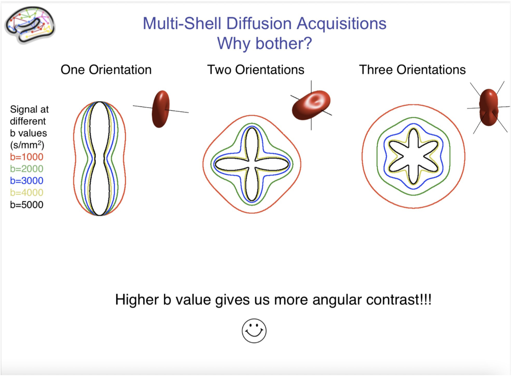

[Bonnes pratiques pour l\'IRM de diffusion en neuro](#_Toc1)

[Groupe d'actions du REMI](#_Toc2)

[Description](#description)

[Responsables](#responsables)

[Objectifs](#objectifs)

[Livrables](#livrables)

[Protocole(s) de Diffusion idéal
(aux)?](#protocoles-de-diffusion-idéal-aux)

[Pour une bonne analyse DTI](#pour-une-bonne-analyse-dti)

[Pour une bonne tractographie](#pour-une-bonne-tractographie)

[Pour du DKI (Diffusion Kurtosis
Imaging)](#pour-du-dki-diffusion-kurtosis-imaging)

[Pour du NODDI](#pour-du-noddi)

[Acquisition](#acquisition)

[Temps de répétition](#temps-de-répétition)

[Multi-bande et/ou Grappa](#multi-bande-etou-grappa)

[Gradient mono ou bi-polaire](#gradient-mono-ou-bi-polaire)

[Acquisitions segmentées](#acquisitions-segmentées)

[Transformée de fourier partielles](#transformée-de-fourier-partielles)

[Résolution](#résolution)

[b-valeurs](#b-valeurs)

[Directions du gradient de
diffusion](#directions-du-gradient-de-diffusion)

[Orientation des coupes](#orientation-des-coupes)

[Sauvegarde des images de phases](#sauvegarde-des-images-de-phases)

[3D-SE-EPI](#d-se-epi)

[Traitement de données :](#traitement-de-données)

# Description

## Responsables

Julien Lamy, Bixente Dilharreguy, Clément Debacker, Bastien Cagna,
Jean-Luc Anton, Marie Chupin, Hugo Dary, Franck Lamberton, Julien Sein,
Arnaud LeTroter, Romain Valabrègue, Romain Viard, Emmanuelle Gourieux

## Objectifs

Établir des bonnes pratiques d\'acquisition et de traitement

### Court terme

exploitation des informations de diffusion depuis les fichiers DICOM

### Long terme

Bonnes pratiques d\'acquisition et de traitement (incluant
recommandations, tutoriel et pipeline de traitement) en DTI et en NODDI

Définir des mesures de qualité des données et de certains types de
résultats

Tester sur des données communes différentes chaînes de pré-traitement

Émettre des recommandations sur les paramètres des acquisitions et les
pré-traitements à mettre en œuvre

Proposer une chaîne de traitement REMI à l'état de l'art et didactique:
script bash, jupyter notebook, \...

## Livrables

Exploitation des informations de diffusion depuis les fichiers DICOM :
comment les directions de diffusion et les b-valeurs sont-elles stockées
dans les fichiers DICOM ?

Une bibliographie structurée et partagée avec zotero:
<https://www.zotero.org/groups/4555775/remi_diffusion>

Lister, pour chaque plateforme/équipe intéressée, les paramètres des
acquisitions utilisées en routine et les pré-traitements couramment mis
en œuvre :
<https://docs.google.com/spreadsheets/d/1vpAtnPMVdDaplYqw-LtMdrbt_VEKoWKpJtNG79KqFxw/edit#gid=0>

Éventuellement lister également les questions souvent abordées en
Neurosciences.

# Protocole(s) de Diffusion idéal (aux)?

L\'idée est ici de réfléchir à un protocole \"standard\" (à 3T pour le
moment mais des discussions pour les autres champs peuvent être
discutées aussi!) qui peut être proposé par le REMI, en compilant
l\'expérience des uns et des autres. Un exemple de pipeline permettant
d\'obtenir des résultats pourrait aussi y être associé.

Le titre est volontairement provocateur car un tel protocole n\'existe
pas, vu la multitude de modèle existant actuellement dans la
littérature, et les contraintes diverses et variées liées à chaque
étude.

Nous pouvons essayer de résumé ici les contributions de chacun et ce
sujet et voir si on converge vers un protocole?

Pour information, voici un récapitulatif de quelques protocoles utilisés
ici et ailleurs:
<https://docs.google.com/spreadsheets/d/1vpAtnPMVdDaplYqw-LtMdrbt_VEKoWKpJtNG79KqFxw/edit#gid=0>

Les choix cruciaux se portent vers:

- La résolution spatiale: limite haute (à 3T): 1.25mm- 1.5mm iso (HCP -
  HCP lifespan) - \"classiquement\" : 2mm iso (UK Biobank)

- Nombre de directions et de shells: limite haute: HCP (90 x 3 shell) x2
  , HCP Lifespan (92 x 2 shells) x 2, ABCD (
  6b300+15b1000+15b2000+60b3000) x 1

- Facteur multibande pour réduire le TR, mais pas trop car sinon perte
  de signal avec repousse T1 pas complète et courants de Foucault
  régules venant du TR précédent.

- accélération parallèle pour réduire le TE (gain de SNR), réduire
  modérément le TR et réduire les distorsions (mais dépendance aux
  mouvement et perte intrinsèque de signal)

- Partial Fourier pour réduire le TE et modérément le TR

- Bande passante en lecture pour obtenir l\'écho spacing minimal, TE
  minimal et limiter les distorsions, mais en sachant que plus elle
  haute et plus le SNR est bas.

- Répéter les différentes directions de diffusion en encodage de phase
  inversé pour une meilleure correction des distorsions?

Le site de DSI-Studio propose et discute un protocole « idéal » à 23
valeurs de b et 258
directions (<https://dsi-studio.labsolver.org/doc/how_to_acquire_dmri.html>).
La comparaison de l'encodage type q-space versus un multi-shell plus
classique est intéressante, notamment le besoin de redondance dans les
valeurs de b acquises pour interpoler les données manquantes au moment
de la correction par « eddy ».

=\> il faut bien noter les avantages et inconvénients de cette méthode
et le fait qu'il faut notamment acquérir avec les gradients de diffusion
en mode dipolaire et que ce type d'acquisition ne convient pas à une
reconstruction de type CSD.

## Pour une bonne analyse DTI

Le premier type d\'analyse auquel on peut penser est le DTI et le
métriques associées telles que FA, MD (=ADC), RD etc\...

J\'ai lu quelque part que la FA estimée étaient dépendante de la valeur
de b utilisée à l\'acquisition et qu\'avec un b \>1200, le modèle de
diffusion faisait que la FA estimé était biaisé (DSI Studio utilise
toutes les directions avec b \< **1750** pour calculer les métriques de
DTI) De fait souvent les études avec plusieurs valeurs de b estiment la
FA avec un sous-échantillon de leur acquisition, avec leur b1000 le plus
souvent. ( Par rapport à ce biais de FA pour des valeurs de b \> 1200,
voir Diffusion Kurtosis Imaging (DKI) )

Concernant les directions de diffusion, 6 suffiraient mais au moins 12,
sont recommandées.

## Pour une bonne tractographie

Dans ce cas, un nombre plus important de directions est requis et
l\'acquisition de plusieurs valeurs de b semble recommandé. (les
réflexions ci-dessous sont en grande partie inspirée des cours du HCP:
<https://wustl.app.box.com/s/pzbdltem3jxjs0uxhz51p3mfpd9csdt5>)

A noter : la critique lue dans DSI studio sur le choix des directions du
HCP (<https://dsi-studio.labsolver.org/doc/how_to_acquire_dmri.html>)

J\'ai le souvenir d\'avoir lu comme recommandations d\'utiliser au moins
30 directions de diffusion à b1000, et d\'utiliser d\'autant plus de
directions que la sphere (correspondant à une certaine valeur de b) est
grande.

Le rationel est le suivant: De plus grandes valeurs de b permettent
d\'avoir une meilleur résolution angulaire pour résoudre les croisements
de fibres, mais plus b est grand et plus le SNR est faible\....

Voir les tests faits par le HCP:

Sotiropoulos, S. N.; Jbabdi, S.; Xu, J.; Andersson, J. L.; Moeller, S.;
Auerbach, E. J.; Glasser, M. F.; Hernandez, M.; Sapiro, G.; Jenkinson,
M.; Feinberg, D. A.; Yacoub, E.; Lenglet, C.; Van Essen, D. C.; Ugurbil,
K.; Behrens, T. E. J. Advances in Diffusion MRI Acquisition and
Processing in the Human Connectome Project. NeuroImage2013, 80,
125--143. <https://doi.org/10.1016/j.neuroimage.2013.05.057>

## Pour du DKI (Diffusion Kurtosis Imaging)

Au moins deux valeur de b. A compléter\...

https://dipy.org/documentation/1.0.0./examples_built/reconst_dki/

## Pour du NODDI

Une première piste: Protocole optimisé dans le papier original de NODDI
(Zhang et al. 2012) : 30 b=711 s/mm\^2 and 60 b=2855 s/mm\^2 and 9b=0

Deuxième piste: Un exemple de protocole utilisé récemment sur une 3T
Siemens Prisma: TA= 22minutes: TE = 74 ms; TR = 4970 ms; GRAPPA
acceleration factor = 2, matrix: 130 130; FOV = 208 208 mm2; nominal
spatial resolution = 1.6 1.6 1.6 mm3; multiband acceleration factor = 2;
phase-encoding direction: A\>P. 228 directions: 38 at b=1000s/mm2, 76 at
b = 2000 s/mm2, and 114 at b = 3000 s/mm2) and 14b = 0 s/mm2 images
(interleaved throughout the acquisition)

https://linkinghub.elsevier.com/retrieve/pii/S0306452221000105

Lehman et al. Longitudinal Reproducibility of Neurite Orientation
Dispersion and Density Imaging (NODDI) Derived Metrics in the White
Matter, Neuroscience (2021)

# Acquisition

Proposition de protocole d\'acquisition, basé sur
https://github.com/neurolabusc/dcm_qa_toshiba.

L\'idée est d\'obtenir un protocole assez facile à mettre en place et
rapide pour déterminer comment les b-valeurs et les directions du
gradient de diffusion sont stockées dans les fichiers DICOM. En
l\'absence de fantôme anisotrope facile à réaliser, il faudrait réaliser
les acquisitions sur un volontaire.

## Temps de répétition

## Multi-bande et/ou Grappa

## Gradient mono ou bi-polaire

## Acquisitions segmentées

## Transformée de fourier partielles

Impact sur les analyses ?

## Résolution

Rorden conseille du 3 mm iso. Ca parait être une résolution peu basse et
on risque d\'y perdre en résolution angulaire ; si le temps le permet, 2
mm iso ou moins) serait plus adapté. La résolution isotrope est en
revanche très importante : sans ça on aura une atténuation différente
selon l\'orientation relative des structures, du voxel, et du gradient
de diffusion.

## b-valeurs

en plus d\'une acquisition à b=0 s/mm\^2, il serait intéressant de faire
les acquisitions à deux b-valeurs (e.g. 750 s/mm\^2 et 1000 s/mm\^2)
afin de mieux identifier le champ contenant cette valeur et les
éventuelles variations liées au stockage soit de la b-valeur idéale
(telle que saisie sur la console) ou de la b-valeur effective (modulée
par les gradients d\'imagerie).

## Directions du gradient de diffusion

12 directions suffisent, si elles sont bien échantillonnées. Si on
utilise les deux b-valeurs précédentes, on peut utiliser 12 directions
pour b=1000 s/mm\^2 et 9 pour b=750 s/mm\^2.

## Orientation des coupes

plusieurs acquisitions avec des orientations de coupes différentes
doivent être réalisés afin de déterminer le repère utilisé par les
directions du gradient de diffusion (patient, aimant, gradient, image,
etc.). On peut s\'en sortir a minima avec trois acquisitions, en axial
pur, sagittal pur, coronal pur. Rorden conseille en plus de rajouter une
orientation oblique à 30 °, et il peut être intéressant de jouer
également avec les directions respectives des gradients de lecture et de
phase (e.g. acquisitions axiales avec lecture en RL et phase en AP puis
lecture en AP et phase en RL).

## Sauvegarde des images de phases

Pour utiliser NORDIC par exemple :
[https://www.sciencedirect.com/science/article/pii/S1053811920310247sdf](https://www.sciencedirect.com/science/article/pii/S1053811920310247)

Mais la question demeure sur la manière de reconstruire la phase. Les
papiers utilisant NORDIC semblent reconstruire la phase à leur façon.
Par exemple :\
« In order to allow distortion correction and processing for complex
data and avoid phase incoherence artifacts, the raw complex-valued
diffusion data were rotated to the real axis using the phase
information. A spatially varying phase-field was estimated and complex
vectors were multiplied with the conjugate of the phase. The phase-field
was estimated uniquely for each slice and volume by firstly removing the
phase variations from k-space sampling and coil sensitivity combination,
and secondly by removing an estimate of a smooth residual phase-field.
The smooth residual phase-field was estimated using a low-pass filter
with a narrowed tapered cosine filter (a Tukey filter with an FWHM of
58%). Hence, the final signal was rotated approximately along the real
axis, subject to the smoothness constraints. »\
Manzano-Patron, J.-P.; Moeller, S.; Andersson, J. L. R.; Yacoub, E.;
Sotiropoulos, S. N. ***Denoising Diffusion MRI: Considerations and
Implications for Analysis*;** preprint; Neuroscience,
2023. [[https://doi.org/10.1101/2023.07.24.550348]{.underline}](https://doi.org/10.1101/2023.07.24.550348).

Code de ce papier qui détaille la préparation de la phase et différentes
méthodes de denoising\
<https://github.com/SPMIC-UoN/EDDEN>\
Manzano Patron, J. P.; Moeller, S.; Andersson, J. L. R.; Ugurbil, K.;
Yacoub, E.; Sotiropoulos, S. N. Denoising Diffusion MRI: Considerations
and Implications for Analysis. *Imaging Neuroscience* **2024**, *2*,
1--29. [[https://doi.org/10.1162/imag_a_00060]{.underline}](https://doi.org/10.1162/imag_a_00060).

Utilisation de la phase pour le denoising avec MRTrix (fonction
dwidenoise) également : deux discussions intéressantes :\
<https://github.com/PennLINC/qsiprep/issues/677>\
<https://community.mrtrix.org/t/unwrapping-before-dwidenoise-on-complex-valued-data/4039>

## 3D-SE-EPI

Nouvelles séquences ou reconstructions fournies par les constructeurs?
(AP et PA simultanées?)

Rq : AP et PA simultanée disponible chez Siemens en C2P pour XA (en 2D
SE-EPI) :\
Afacan, O.; Hoge, W. S.; Wallace, T. E.; Gholipour, A.; Kurugol, S.;
Warfield, S. K. **Simultaneous Motion and Distortion Correction Using
Dual-Echo Diffusion-Weighted MRI.** Journal of
Neuroimaging 2020, 30 (3),
276--285. [[https://doi.org/10.1111/jon.12708]{.underline}](https://doi.org/10.1111/jon.12708).

# Traitement de données :

voir ici
https://resana.numerique.gouv.fr/public/perimetre/consulter/532839?information=44532971
