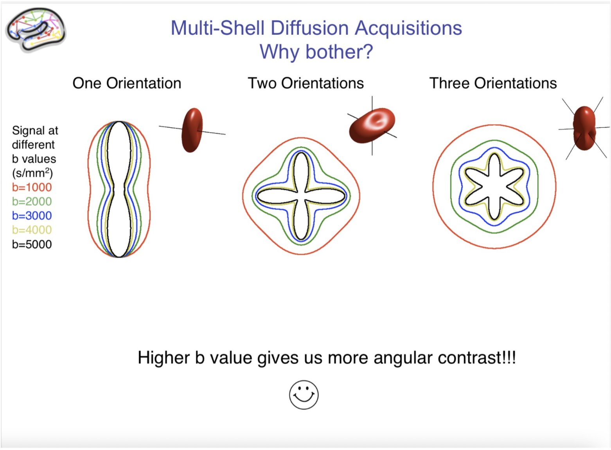

## Pour une bonne analyse DTI

Le premier type d'analyse auquel on peut penser est le DTI et le
métriques associées telles que FA, MD (=ADC), RD etc...

J'ai lu quelque part que la FA estimée étaient dépendante de la valeur
de b utilisée à l'acquisition et qu'avec un b >1200, le modèle de
diffusion faisait que la FA estimé était biaisé (DSI Studio utilise
toutes les directions avec b < **1750** pour calculer les métriques de
DTI) De fait souvent les études avec plusieurs valeurs de b estiment la
FA avec un sous-échantillon de leur acquisition, avec leur b1000 le plus
souvent. ( Par rapport à ce biais de FA pour des valeurs de b > 1200,
voir Diffusion Kurtosis Imaging (DKI) )

Concernant les directions de diffusion, 6 suffiraient mais au moins 12,
sont recommandées.

## Pour une bonne tractographie

Dans ce cas, un nombre plus important de directions est requis et
l'acquisition de plusieurs valeurs de b semble recommandé. (les
réflexions ci-dessous sont en grande partie inspirée des cours du HCP:
<https://wustl.app.box.com/s/pzbdltem3jxjs0uxhz51p3mfpd9csdt5>)

A noter : la critique lue dans DSI studio sur le choix des directions du
HCP (<https://dsi-studio.labsolver.org/doc/how_to_acquire_dmri.html>)

J'ai le souvenir d'avoir lu comme recommandations d'utiliser au moins
30 directions de diffusion à b1000, et d'utiliser d'autant plus de
directions que la sphere (correspondant à une certaine valeur de b) est
grande.

Le rationel est le suivant: De plus grandes valeurs de b permettent
d'avoir une meilleur résolution angulaire pour résoudre les croisements
de fibres, mais plus b est grand et plus le SNR est faible....

Voir les tests faits par le HCP:

Sotiropoulos, S. N.; Jbabdi, S.; Xu, J.; Andersson, J. L.; Moeller, S.;
Auerbach, E. J.; Glasser, M. F.; Hernandez, M.; Sapiro, G.; Jenkinson,
M.; Feinberg, D. A.; Yacoub, E.; Lenglet, C.; Van Essen, D. C.; Ugurbil,
K.; Behrens, T. E. J. Advances in Diffusion MRI Acquisition and
Processing in the Human Connectome Project. NeuroImage2013, 80,
125--143. <https://doi.org/10.1016/j.neuroimage.2013.05.057>

## Pour du DKI (Diffusion Kurtosis Imaging)

Au moins deux valeur de b. A compléter...

https://dipy.org/documentation/1.0.0./examples_built/reconst_dki/

## Pour du NODDI

Une première piste: Protocole optimisé dans le papier original de NODDI
(Zhang et al. 2012) : 30 b=711 s/mm^2 and 60 b=2855 s/mm^2 and 9b=0

Deuxième piste: Un exemple de protocole utilisé récemment sur une 3T
Siemens Prisma: TA= 22minutes: TE = 74 ms; TR = 4970 ms; GRAPPA
acceleration factor = 2, matrix: 130 130; FOV = 208 208 mm2; nominal
spatial resolution = 1.6 1.6 1.6 mm3; multiband acceleration factor = 2;
phase-encoding direction: A>P. 228 directions: 38 at b=1000s/mm2, 76 at
b = 2000 s/mm2, and 114 at b = 3000 s/mm2) and 14b = 0 s/mm2 images
(interleaved throughout the acquisition)

https://linkinghub.elsevier.com/retrieve/pii/S0306452221000105

Lehman et al. Longitudinal Reproducibility of Neurite Orientation
Dispersion and Density Imaging (NODDI) Derived Metrics in the White
Matter, Neuroscience (2021)

