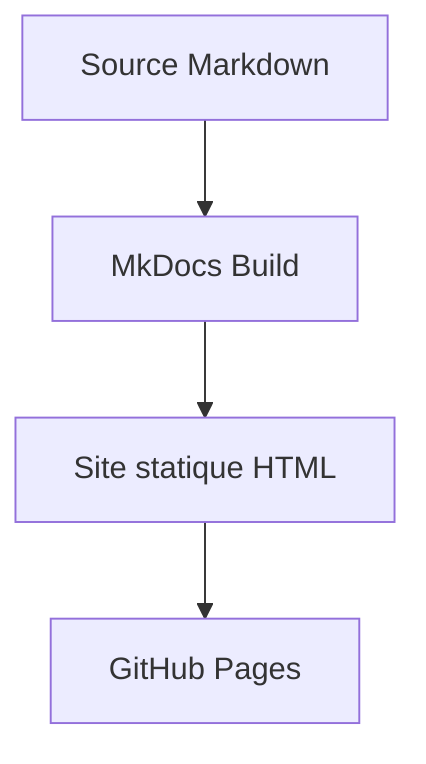

# Guide de contribution

Ce guide est destiné aux personnes qui souhaitent modifier le contenu du site (qui est généré avec **MkDocs**).

## Créer ou modifier une page Markdown

1. Pour ajouter une nouvelle page, créez un fichier `.md` à l'endroit voulu, par exemple dans le dossier `acquisition/` ou `analyses/`.
2. Pour modifier une page existante, ouvrez le fichier Markdown correspondant.
3. Rédigez votre contenu en utilisant la syntaxe Markdown (titres avec `#`, listes, liens, etc.).

Gardez une logique de nommage simple et stable. Les fichiers déjà présents suivent souvent un format numéroté, par exemple `01-preparation-bids.md`.

**Important** : Si vous ajoutez une *nouvelle* page, elle n'apparaîtra pas automatiquement dans le menu du haut. Vous devez l'ajouter dans le fichier de configuration (voir ci-dessous).

## Modifier le menu de navigation (barre du haut)

L'architecture du menu principal est définie dans le fichier **`mkdocs.yml`** situé à la racine du projet.

Pour ajouter une page au menu ou modifier un bouton existant :
1. Ouvrez `mkdocs.yml`.
2. Descendez à la section `nav:`.
3. Ajoutez ou modifiez une ligne en respectant l'indentation. Le format est `- Titre du bouton: chemin/vers/le/fichier.md`.

Exemple :
```yaml
nav:
  - Accueil: index.md
  - Acquisition:
    - Introduction: acquisition/index.md
    - Ma nouvelle page: acquisition/nouvelle-page.md
```

## Ajouter une image

Les images doivent être placées dans le dossier `assets/` (par exemple `assets/images/`).

Dans une page Markdown, utilisez un chemin relatif pour pointer vers l'image. MkDocs s'occupe de résoudre le lien lors de la création du site.

```markdown

```

Bonnes pratiques :
- Choisissez un nom de fichier explicite et sans espaces.
- Ajoutez un texte alternatif utile pour la lecture et l'accessibilité.

## Ajouter un graphique Mermaid

MkDocs Material gère nativement les diagrammes Mermaid. Vous pouvez les écrire directement dans vos fichiers Markdown :



## Ajouter un notebook ou un script dans `tutorial/notebooks`

Le dossier `tutorial/notebooks/` est prévu pour les notebooks et les scripts liés aux analyses de diffusion.

Pour ajouter un notebook :
1. Créez un fichier `.ipynb` dans `tutorial/notebooks/`.
2. Utilisez un nom clair, par exemple `01-qc-dwi.ipynb`.

Pour ajouter un script :
1. Créez un fichier `.py` dans `tutorial/notebooks/`.
2. Donnez-lui un nom numéroté et explicite.

Si vous ajoutez des fichiers ici, pensez à les lister ou les expliquer dans le fichier `tutorial/index.md` (ou via des fichiers `README.md` dédiés).

## Prévisualiser le site en direct (Local)

Au lieu de juste prévisualiser le Markdown, vous pouvez voir le site complet tel qu'il apparaîtra en ligne.
Si vous avez installé MkDocs et son thème Material (via `pip install mkdocs-material`), vous pouvez lancer :

```bash
mkdocs serve
```
Le site sera disponible sur `http://127.0.0.1:8000/` et se mettra à jour automatiquement à chaque sauvegarde d'un fichier !

*Alternativement*, VS Code permet toujours de prévisualiser de simples fichiers Markdown avec `Ctrl+Shift+V`.

## Pousser ses changements

Une fois vos modifications terminées, le site se mettra à jour automatiquement en ligne grâce à GitHub Actions. Il suffit de pousser vos fichiers :

### Depuis GitHub Desktop
1. Ouvrez GitHub Desktop.
2. Cliquez sur `Commit to main`.
3. Cliquez sur `Push origin`.

### Depuis VS Code
1. Ouvrez le panneau "Source Control".
2. Entrez un message de commit clair (ex: "Ajout de la section tractographie").
3. Cliquez sur `Commit` puis `Sync Changes` (ou `Push`).

### En ligne de commande
```bash
git add .
git commit -m "Ajout d'une nouvelle section"
git push
```

Dans la minute qui suit votre *Push*, l'Action GitHub reconstruira le site MkDocs et publiera la nouvelle version sur GitHub Pages !
