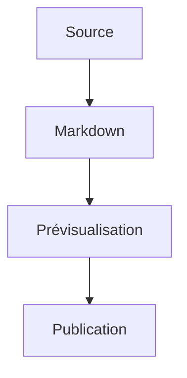

## Guide de contribution

Ce guide est destiné aux personnes qui modifient le site Markdown lui-même.

## Créer une page Markdown

Pour ajouter une nouvelle page, crée un fichier `.md` à l'endroit voulu, par exemple dans `analyses/` ou `acquisition/`.

Exemple de structure minimale:

```markdown
# Titre de la page

Un court texte d'introduction.

## Sous-section

Du contenu, des listes, des liens, des images.
```

Garde une logique de nommage simple et stable. Les fichiers déjà présents dans ce dépôt suivent un format numéroté, par exemple `01-preparation-bids.md`.

## Modifier une page existante

1. Ouvre le fichier Markdown dans VS Code.
2. Modifie le contenu avec le titre, les sous-titres et les paragraphes voulus.
3. Prévisualise le résultat avant de valider.
4. Sauvegarde le fichier puis pousse les changements sur GitHub.

Si tu modifies le sommaire du site, pense aussi à mettre à jour `index.md`.

## Ajouter une image

Les images doivent être placées dans `assets/images/` avec une arborescence proche des pages Markdown:

- `assets/images/acquisition/`
- `assets/images/analyses/`
- `assets/images/tutorial/`
- `assets/images/site/` (logo, éléments globaux)

Dans une page Markdown, utilise la syntaxe suivante:

```markdown

```

Bonnes pratiques:

- Choisis un nom de fichier explicite et sans espaces.
- Ajoute un texte alternatif utile pour la lecture et l'accessibilité.
- Vérifie que le chemin est bien relatif à la page Markdown.
- Garde l'image dans le dossier de sa section pour éviter un dossier unique surchargé.

## Modifier les boutons du site

Les boutons en haut du site sont définis une seule fois dans `_data/navigation.yml` et affichés par le layout global.

Pour changer un bouton existant ou lui faire pointer vers une autre page:

1. Ouvre `_data/navigation.yml`.
2. Modifie le champ `label` pour changer le texte du bouton.
3. Modifie le champ `url` pour pointer vers la page voulue, par exemple `/analyses/03-pretraitements.html`.
4. Ajuste `match` si tu veux que le bouton reste surligné sur une autre section.

Exemple:

```yaml
- label: Tutorial
  url: /tutorial/index.html
  path: tutorial/index.md
  match: tutorial/
```

Si tu ajoutes une nouvelle page principale, ajoute aussi une entrée dans ce fichier pour qu'elle apparaisse comme bouton global.

## Ajouter un graphique

Il y a deux cas fréquents.

Si le graphique est une image exportée depuis un logiciel, enregistre-le dans le sous-dossier de section correspondant puis insère-le comme une image classique.

Si tu veux écrire un schéma directement dans le Markdown, tu peux utiliser un bloc de diagramme Mermaid si le rendu le prend en charge:



## Ajouter un notebook ou un script dans `tutorial/notebooks`

Le dossier `tutorial/notebooks/` est prévu pour les notebooks et les scripts liés aux analyses de diffusion.

Pour ajouter un notebook:

1. Crée un fichier `.ipynb` dans `tutorial/notebooks/`.
2. Utilise un nom clair, par exemple `01-qc-dwi.ipynb` ou `02-preprocessing.ipynb`.
3. Si le notebook dépend d'un contexte particulier, ajoute un petit fichier `README.md` dans le même sous-dossier pour expliquer l'objectif.

Pour ajouter un script:

1. Crée un fichier `.py` dans `tutorial/notebooks/` ou dans un sous-dossier dédié si le projet grossit.
2. Donne-lui un nom numéroté et explicite, par exemple `01-run_qc.py`.
3. Indique dans le `README.md` comment le lancer et quelles entrées il attend.

Bonnes pratiques:

- Garde les jeux de données volumineux hors du dépôt.
- Écris en tête du notebook ou du script les dépendances nécessaires.
- Si le fichier sert de support au site, ajoute un lien vers lui depuis `tutorial/index.md`.

## Prévisualiser en direct dans VS Code

VS Code permet de voir le rendu Markdown pendant l'édition.

Méthode simple:

1. Ouvre le fichier `.md`.
2. Lance la prévisualisation avec `Ctrl+Shift+V`.
3. Utilise `Ctrl+K V` pour ouvrir la preview à côté du fichier.

La preview se met à jour automatiquement quand tu modifies le fichier, ce qui suffit dans la plupart des cas.

Les extensions `markdownlint` et `Markdown All in One` améliorent le confort d'édition, mais la prévisualisation Markdown fonctionne aussi sans extension.

## Extensions VS Code utiles

### markdownlint

Cette extension vérifie la qualité du Markdown et signale les incohérences les plus courantes: titres mal structurés, espaces en trop, listes mal formées, liens cassés dans certains cas.

### Markdown All in One

Cette extension ajoute des raccourcis pratiques: tables, listes de tâches, numérotation, sommaire automatique et aide à la navigation dans les titres.

Utilisation courante:

- créer rapidement des listes et des tableaux
- générer ou mettre à jour une table des matières
- naviguer entre les titres du document

## Cloner le dépôt GitHub

### Avec VS Code

1. Ouvre VS Code.
2. Lance la commande `Git: Clone`.
3. Colle l'URL du dépôt GitHub.
4. Choisis un dossier local.
5. Ouvre le projet une fois le clonage terminé.

### Cloner avec GitHub Desktop

1. Ouvre GitHub Desktop.
2. Choisis `File > Clone repository`.
3. Sélectionne le dépôt ou colle son URL.
4. Choisis le dossier local de destination.
5. Clique sur `Clone` puis ouvre le dépôt dans VS Code si besoin.

### Cloner en ligne de commande

```bash
git clone https://github.com/organisation/nom-du-depot.git
cd nom-du-depot
```

## Pousser ses changements

### Depuis VS Code

1. Modifie tes fichiers.
2. Ouvre le panneau Source Control.
3. Vérifie les fichiers modifiés.
4. Entre un message de commit.
5. Clique sur `Commit` puis `Push` ou `Sync Changes`.

### Pousser avec GitHub Desktop

1. Sélectionne les fichiers modifiés.
2. Renseigne un message de commit.
3. Clique sur `Commit to main`.
4. Clique sur `Push origin`.

### Pousser en ligne de commande

```bash
git status
git add .
git commit -m "Ajout d'une page"
git push
```

## Cas pratique

Pour ajouter une nouvelle page dans ce site:

1. Crée le fichier `.md` dans le bon dossier.
2. Rédige la page avec des titres simples.
3. Ajoute les images dans le sous-dossier adapté de `assets/images/` si nécessaire.
4. Mets à jour `index.md` si la page doit être visible dans le sommaire.
5. Prévisualise le Markdown dans VS Code.
6. Commit puis push les changements.

## Conseils rapides

- Évite les titres trop profonds si la page est courte.
- Préfère des images légères et bien nommées.
- Vérifie les liens relatifs après déplacement de fichiers.
- Si un fichier ne doit pas être publié, ajoute-le dans `.gitignore` avant de le committer.
